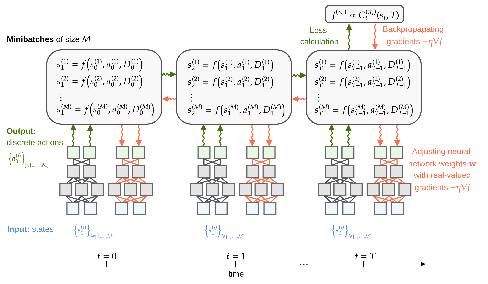

[](https://pubsonline.informs.org/journal/ijoc)

# [Control of Dual-Sourcing Inventory Systems using Recurrent Neural Networks](https://doi.org/10.1287/ijoc.2022.0136)

This archive is distributed in association with the [INFORMS Journal on
Computing](https://pubsonline.informs.org/journal/ijoc) under the [MIT License](LICENSE).

The software in this repository is a snapshot of the software that was used in the research reported 
on in the paper [Control of Dual-Sourcing Inventory Systems using Recurrent Neural Networks](https://doi.org/10.1287/ijoc.2022.0136) by Lucas Böttcher, Thomas Asikis, and Ioannis Fragkos.

## Cite

To cite the contents of this repository, please cite both the paper and this repository, using their respective DOIs.

https://doi.org/10.1287/ijoc.2022.0136

https://doi.org/10.1287/ijoc.2022.0136.cd

Below is the BibTex for citing this snapshot of the respoitory.

```
@article{bottcher2023control,
  author =        {B{\"o}ttcher, Lucas and Asikis, Thomas and Fragkos, Ioannis},
  publisher =     {INFORMS Journal on Computing},
  title =         {Control of Dual-Sourcing Inventory Systems using Recurrent Neural Networks},
  year =          {2023},
  doi =           {10.1287/ijoc.2022.0136.cd},
  note =          {Available for download at \url{https://github.com/INFORMSJoC/2022.0136}},
}  
```

## Description

This project provides implementations of neural networks that control single-sourcing dynamics and dual-sourcing dynamics, with or without empirical demand data. 

We summarize the main model parameters below.

| parameter | type    | description                                                   |
| --------- | ------- | --------------------------------------------------------------|
| `ce`      | int     | expedited order cost (per unit)                               |
| `cr`      | int     | regular order cost (per unit)                                 |
| `fe`      | int     | fixed expedited order cost (per unit)                         |
| `fr`      | int     | fixed regular order cost (per unit)                           |
| `h`       | int     | holding cost (per unit)                                       |
| `b`       | int     | shortage cost (per unit)                                      |
| `le`      | int     | expedited order lead time                                     |
| `lr`      | int     | regular order lead time                                       |
| `T`       | int     | number of simulation periods                                  |

<div align="center">

</div>

The above figure shows a schematic of solving discrete-time stochastic control problems with recurrent neural networks. More information on implementation details are provided in our paper.

## Data

The `data/cdi_nnc/` directory comprises data on dual sourcing costs for both capped dual-index (CDI) and neural-network policies. It also includes supplementary data on neural-network training runtimes and various data visualization scripts.

In the `data/MSOM_data/` directory, we store the empirical demand data obtained from Manary, Matthew P., and Sean P. Willems. "Data set: 187 weeks of customer forecasts and orders for microprocessors from intel corporation." Manufacturing & Service Operations Management 24.1 (2022): 682-689.

## Code

The `code/sourcing_models/` directory contains various implementations of dual sourcing heuristics, including single index, dual index, capped dual index, and tailored base surge. The file `code/sourcing_models/recursion_numba_state_output.py` offers a dynamic program solution for the dual-sourcing problem with fixed costs. To accelerate the dynamic programming iterations, we utilize the high-performance Python compiler ``Numba``.

To execute the program `recursion_numba_state_output.py` within the `code/sourcing_models/` directory, use the following command:

```shell
python recursion_numba_state_output.py recursion_input_files/ds1_lr=2_b=95_h=5_u04.in
```

Here, `ds1_lr=2_b=95_h=5_u04.in` refers to a file that contains input parameters for the dynamic program.

The `code/sourcing_models/trained_neural_nets` directory provides trained neural networks that can be employed for transfer-learning tasks.

In the `code/neural_control/` directory, you can find different neural-network controllers and inventory dynamics implementations using ``PyTorch``. Specifically, long short-term memory and transformer implementations are accessible under `code/neural_control/experiments`.

The `code/notebooks/` directory contains a collection of Jupyter notebooks designed for conducting numerical experiments related to controlling single-sourcing dynamics and dual-sourcing dynamics, with or without fixed costs. These notebooks encompass various neural-network controllers and also include comparisons with capped dual-index policies.

For an optimization example utilizing empirical demand data, refer to the `code/MSOM_data/` directory.

## Ongoing Development

This code is being developed on an on-going basis at the author's
[Gitlab site](https://gitlab.com/ComputationalScience/inventory-optimization/).

